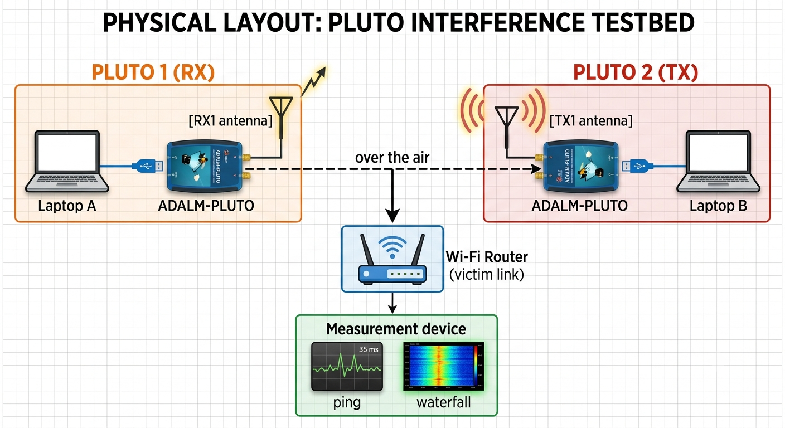

# ENCS5323 – Spectrum Sensing & Controlled RF Interference using ADALM-PLUTO SDR

## Project Overview

This project implements a real-world **spectrum sensing** and **controlled RF interference** platform using the **ADALM-PLUTO Software Defined Radio (SDR)** for the course **ENCS5323 – Wireless and Mobile Networks**.

The project is divided into two complementary components:

### Component 1 — Spectrum Sensing

This component captures live RF signals across both licensed and unlicensed frequency bands.

Supported bands include:

* GSM 900 Downlink
* GSM 1800 Downlink
* 2.4 GHz ISM Band (Wi-Fi)

For each selected band, the system:

* Performs a wideband Power Spectral Density (PSD) scan
* Automatically detects occupied channels
* Generates waterfall (spectrogram) plots to visualize temporal spectrum variations
* Saves both figures and raw measurement data

---

### Component 2 — Controlled RF Interference

This component generates controlled interference inside the **2.4 GHz ISM band** and evaluates its effect on an active Wi-Fi link.

Performance is measured using:

* Round-trip latency (RTT)
* Jitter
* Packet loss

Measurements are repeated under different interference power levels and waveform types, allowing quantitative analysis of network degradation.

---

Together, these two components provide an empirical characterization of spectrum occupancy and demonstrate, through measured data, how intentional RF interference affects wireless network performance.

This README serves as the complete technical reference for the project, including architecture, implementation, execution steps, and repository organization. The accompanying project report provides the condensed academic presentation of the work.

---

# Repository Structure

```text
ENCS5323_Project/
├── main.py                        # Interactive menu (main entry point)
├── config.py                      # System configuration
├── pluto_utils.py                 # Pluto connection helper
│
├── sensing/                       # Component 1 — Spectrum Sensing
│   ├── __init__.py
│   ├── wideband_scan.py
│   └── waterfall.py
│
├── interference/                  # Component 2 — Controlled Interference
│   ├── __init__.py
│   ├── jammer.py
│   ├── measure_link.py
│   └── plot_results.py
│
├── data_sensing/
├── figures_sensing/
├── data_interference/
├── figures_interference/
├── waterfall_before_after_noise/
```

---

# File Responsibilities

| File                              | Description                                                                                                       |
| --------------------------------- | ----------------------------------------------------------------------------------------------------------------- |
| **main.py**                       | Interactive menu used to access all project functionality                                                         |
| **config.py**                     | Stores system configuration including Pluto URI, gain, frequency bands, sample rates, and output directories      |
| **pluto_utils.py**                | Connects to the Pluto SDR using the configured URI or automatic device detection                                  |
| **sensing/wideband_scan.py**      | Performs wideband PSD scans, stitches frequency segments, detects occupied channels, and saves plots and CSV data |
| **sensing/waterfall.py**          | Captures repeated PSD measurements and generates waterfall (spectrogram) visualizations                           |
| **interference/jammer.py**        | Generates controlled interference signals (noise, tone, or sweep) and transmits them using Pluto TX               |
| **interference/measure_link.py**  | Measures RTT, jitter, and packet loss using repeated ICMP ping tests                                              |
| **interference/plot_results.py**  | Compares baseline, interference, and recovery measurements using summary plots                                    |

---

## 2. System Setup

The system was implemented using two ADALM-PLUTO Software Defined Radio (SDR) units, each connected via USB to a separate laptop running Python. The two units were assigned complementary roles depending on the experiment, as summarized below.

**Hardware Configuration**

| Role | Device | Connection |
|---|---|---|
| Spectrum Sensing (RX) | ADALM-PLUTO #1 | USB to Laptop A |
| Interference Generator (TX) | ADALM-PLUTO #2 | USB to Laptop B |
| Victim / Measurement Device | Laptop / smartphone connected to the router's Wi-Fi | — |

For Component 1 (spectrum sensing), a single Pluto unit was sufficient, since it operates purely in receive mode and requires no transmission. For Component 2 (interference), one Pluto transmitted the controlled interference signal (via its TX1 port) while a second Pluto — or a separate device on the same network — was used to observe the resulting spectral occupancy and to measure the degradation in link performance. No physical connection existed between the transmitter and the receiver; all interaction occurred over the air, through their respective antennas connected to the TX1 and RX1 ports.

**Physical Layout**



**Software Stack**

The system was developed in Python 3, using the following libraries:
- `pyadi-iio` / `pylibiio` — control of the Pluto radio (sample rate, LO frequency, gain, TX/RX buffers)
- `numpy` / `scipy.signal` — FFT-based power spectral density estimation (Welch's method)
- `matplotlib` — visualization (PSD plots, waterfalls, comparison charts)

**Default Radio Configuration**

| Parameter | Value |
|---|---|
| Sample rate (instantaneous bandwidth) | 2 MHz (GSM) / 20 MHz (Wi-Fi/ISM) |
| RX gain mode | Manual, 40 dB (for repeatable measurements) |
| TX gain (interference) | 0 dB to −30 dB (adjustable, capped ≤ 0 dB) |
| RX buffer size | 262,144 samples |

All experiments were conducted indoors, in a controlled environment, using low transmission power and short transmission durations, in accordance with the project's safety requirements.
---

# Software Requirements

Install the required Python packages:

```bash
python -m pip install pyadi-iio pylibiio numpy scipy matplotlib
```

Windows users must additionally install:

* PlutoSDR USB Drivers
* libiio

Verify that the Pluto SDR is detected:

```bash
iio_info -s
```

For throughput measurements, install **iperf3** on both:

* the measurement laptop (client)
* another device on the same network (server)

---

# Connecting the Pluto SDR

The default device URI is defined inside `config.py`:

```python
PLUTO_URI = "ip:192.168.2.1"
```

The helper function `connect_pluto()` attempts connection using the following order:

1. Configured URI
2. Automatic detection via `iio_info -s`
3. Common fallback URIs

This approach keeps the system operational even if the Pluto's USB address changes between sessions.

---

# Running the Project

Launch the interactive menu:

```bash
python main.py
```

```
╔════════════════════════════════════════════════════╗
║ ENCS5323 - Spectrum Sensing & RF Interference      ║
║ ADALM-PLUTO SDR                                    ║
╚════════════════════════════════════════════════════╝

Component 1 – Spectrum Sensing

1. Wideband PSD Scan
2. Waterfall / Temporal Variability

Component 2 – Controlled Interference

3. Transmit Interference (TX)
4. Measure Link (Ping)
5. Measure Throughput (iperf3)
6. Compare Results

Extras

7. Quick Demo
8. Exit
```

Each option requests its parameters interactively, providing sensible default values that can be accepted by simply pressing **Enter**.

Generated data are automatically organized into dedicated folders:

```
data_sensing/
figures_sensing/

data_interference/
figures_interference/
```

---

# Default Radio Configuration

| Parameter      |        GSM Scan | Wi-Fi / ISM Scan |            Interference TX |
| -------------- | --------------: | ---------------: | -------------------------: |
| Sample Rate    |           2 MHz |           20 MHz |                     20 MHz |
| Gain Mode      |          Manual |           Manual |                          — |
| RX Gain        |           40 dB |            40 dB |                          — |
| TX Gain        |               — |                — | 0 to −30 dB (maximum 0 dB) |
| RX Buffer Size | 262,144 samples |  262,144 samples |                          — |

---

# Safety Notes

All interference experiments were performed:

* Indoors
* At low transmission power
* For short durations (≤ 60 seconds)
* Only on the group's own Wi-Fi router

The interference was intentionally limited in power and duration to satisfy the project's safety requirements while preventing unintended impact on nearby wireless systems.

رغد، هاي نتائج غنية كثير — عندك تغطية كاملة لكل الـ bands (GSM900, GSM1800, WiFi ch1/6/11) بس PSD وwaterfall لكل وحدة. خليني أكتبلك قسم Component 1 كامل بالـ README، بالتفصيل المطلوب.

---

## 4. Component 1 — Spectrum Sensing

### 4.1 Methodology

**Wideband PSD Scan:** Since the Pluto's instantaneous bandwidth is limited to its sample rate (2 MHz for GSM, 20 MHz for Wi-Fi/ISM), wide bands are covered by stepping the local oscillator (LO) across the target range in overlapping tiles, computing the Welch PSD estimate for each tile, and stitching the results into one continuous spectrum. A noise floor is estimated as the median power across the whole scan, and any contiguous region rising more than 6 dB above this floor is flagged as an "occupied channel."

**Waterfall (Temporal Variability):** At a fixed center frequency, the PSD is recomputed repeatedly (10 times/second) and stacked as rows over time, producing a spectrogram where the x-axis is frequency, the y-axis is time, and color represents power. This reveals whether a signal is continuous or intermittent — information a single static PSD snapshot cannot show.

### 4.2 Results — GSM 900 Downlink (935–960 MHz)


**`scan_GSM900_DL.png`** — 8 occupied channels detected, noise floor at −56.7 dB.

Two clusters of strong, continuous carriers are visible: one around 945–946 MHz (peaking near −16 dB, i.e. ~40 dB above the noise floor) and one around 955–960 MHz. The region between 938 MHz and 945 MHz is comparatively quiet, showing that occupancy is concentrated at specific carrier frequencies rather than spread uniformly — consistent with fixed-channel cellular allocation.


**`waterfall_946MHz.png`** (10 s) and **`waterfall_946MHz_60duration.png`** (60 s) — Both show the same pattern: vertical bright bands that remain constant in position and brightness across the entire recording. This confirms that GSM downlink carriers transmit **continuously**, with no visible on/off bursting behavior, which matches the theoretical model of a base station's broadcast control channel (BCCH).

### 4.3 Results — GSM 1800 Downlink (1805–1880 MHz)


**`scan_GSM1800_DL.png`** — 0 occupied channels detected (noise floor −37.9 dB). No signal crosses the occupancy threshold anywhere in this 75 MHz range at the time of measurement — likely because no DCS-1800 base station was transmitting a sufficiently strong signal at this location, or the band is less utilized locally compared to GSM 900.


**`waterfall_1845MHz.png`** (60 s) and **`waterfall_1846MHz.png`** (10 s) — Despite no channel being flagged by the automatic detector, a faint but persistent vertical line is visible near 1845.0 MHz in both waterfalls, remaining stable across the full 60-second recording. This suggests a weak but continuous signal (below the 6 dB detection threshold) — again consistent with the "always-on" nature of cellular signaling, just at low received power.

### 4.4 Results — 2.4 GHz ISM Band (Wi-Fi Channels 1, 6, 11)


**`scan_WIFI_CH1.png`** — 1 occupied channel detected near 2411.4 MHz. A dense, rapidly-varying cluster of activity is also visible around 2417.5–2420 MHz, with power spikes reaching well above the surrounding Wi-Fi activity — the sharp, narrow, and repetitive shape is characteristic of **Bluetooth/BLE frequency-hopping** rather than Wi-Fi's wider OFDM signal.


**`scan_WIFI_CH6.png`** — 2 occupied channels detected. The PSD shows a broad hump spanning roughly 2432–2442 MHz, consistent with a 20 MHz-wide Wi-Fi channel, plus a distinctive narrowband "ringing" pattern around 2443–2445 MHz that likely corresponds to a separate, weaker transmission (possibly an adjacent, low-power Wi-Fi or IoT device).


**`scan_WIFI_CH11.png`** — 0 occupied channels detected, noise floor at −60.5 dB (the lowest of all scans). A narrow, sharp spike at exactly 2462 MHz stands out from the smooth surrounding curve — even though it doesn't cross the automatic 6 dB threshold, it is visually distinct and may represent a very low-duty-cycle transmission (e.g., an infrequent beacon).

**Waterfalls (Wi-Fi channels):**


- **`waterfall_2412MHz.png`** (10 s) / **`waterfall_2412MHz_60duration.png`** (60 s) — Sparse horizontal bright lines appear at irregular intervals, each lasting a fraction of a second, with long gaps of near-silence in between. This is the signature of **bursty Wi-Fi traffic**: the channel is only active when data is actually being transmitted.


- **`waterfall_2437MHz.png`** (10 s) / **`waterfall_2437MHz_60duration.png`** (60 s) — Similar bursting pattern but visibly **more frequent and more continuous** than channel 1, consistent with heavier traffic load (this channel showed the strongest broadband PSD hump in the static scan as well).


- **`waterfall_2462MHz.png`** (10 s) / **`waterfall_2462MHz_60duration.png`** (60 s) — The lowest activity of the three Wi-Fi channels: mostly a faint, mottled texture with only occasional brighter streaks, matching the "0 channels detected" result from the static scan.

### 4.5 Key Comparison — Licensed vs. Unlicensed Bands

| Property | GSM (900/1800) | Wi-Fi (2.4 GHz ISM) |
|---|---|---|
| Waterfall pattern | Solid vertical lines | Sparse horizontal bursts |
| Temporal behavior | Continuous | Intermittent (bursty) |
| Cause | Always-on broadcast control channel | Data transmitted only on demand |

This is the central empirical finding of Component 1: **licensed cellular spectrum is occupied continuously at fixed frequencies, while unlicensed Wi-Fi spectrum is occupied intermittently, in short bursts, with usage intensity varying by channel** (channel 6 busiest, channel 11 quietest in this measurement).

## 5. Component 2 — Controlled Interference

### 5.1 Methodology

**How the jammer works (`interference/jammer.py`):**

The Pluto's transmitter is tuned to a target center frequency (matching the victim Wi-Fi channel), and a baseband complex waveform is continuously transmitted using a cyclic TX buffer (the same block of samples repeats with no gaps). Three waveform types are supported, each generated at a sample rate of 20 MHz (65,536 samples per buffer):

1. **Noise** — complex Gaussian noise, band-limited in the frequency domain to a chosen bandwidth (via FFT → zero out-of-band bins → inverse FFT). This spreads the interference energy across a wide portion of the channel.
2. **Tone** — a single carrier at zero frequency offset from the LO (i.e., a pure sinusoid at the exact center frequency). All transmitted energy is concentrated at one point in the spectrum.
3. **Sweep** — a linear chirp whose instantaneous frequency ramps from −BW/2 to +BW/2 across the buffer duration, so the interference "sweeps" across the channel over time rather than sitting still.

Before transmitting, the code enforces two safety constraints: TX gain is clamped to ≤ 0 dB (0 dB is the Pluto's maximum output power — there is no "louder" setting; more negative values attenuate it), and duration is capped at 60 seconds. The user must explicitly type `yes` to confirm before any transmission begins.

**How the measurement tool works (`interference/measure_link.py`):**

Running on the victim device (any machine connected to the target Wi-Fi — no SDR required), the tool sends one ICMP ping per interval (default every 0.2 s) to a target IP (typically the router's gateway address, found via `ipconfig`). For each ping it records the round-trip time (RTT) in milliseconds, or marks it as lost if no reply arrives within the timeout. At the end of the run it computes:
- **Packet loss (%)** — fraction of pings that received no reply
- **Mean / median / max RTT** — latency statistics
- **Jitter** — standard deviation of RTT, i.e. how much latency fluctuates

Results are saved to `data_interference/link_<label>.csv` (raw, per-ping) and `summary_<label>.csv` (aggregate stats), where `<label>` is a name chosen by the user (e.g. `baseline`, `jammed`).

**Experiment flow:**

```
1. baseline   — measure_link.py runs with the jammer OFF (normal network conditions)
2. jammed     — jammer.py transmits while measure_link.py runs simultaneously
3. recovery   — measure_link.py runs again after the jammer stops
4. compare    — plot_results.py loads all three labels and plots them together
```

This before/during/after structure isolates the effect of the interference: any degradation seen only in the "jammed" run, which disappears in "recovery," can be attributed to the transmitted signal rather than unrelated network noise.

### 5.2 Waveform Types Explained

| Waveform | Spectral shape | Physical interpretation | Typical effect |
|---|---|---|---|
| **Noise** | Flat, spread across the full bandwidth | Broadband jammer — energy is "diluted" over many MHz | Increases the *probability* that some part of every transmission collides with the interference → more frequent, shallower disruption |
| **Tone** | A single sharp spike at one frequency | Narrowband jammer — all energy concentrated at one point | Rarely collides with a transmission, but when it does, the collision is severe (can hit critical parts like preambles/ACKs) → rare but severe latency spikes |
| **Sweep** | A moving spike that scans across the band over time | Swept CW jammer — narrowband power that visits every frequency in turn | Intermediate behavior: touches every part of the channel briefly, similar total exposure to noise but delivered as discrete narrowband "hits" |

This is the same trade-off known in classical jamming theory: **spread energy = probability-of-collision jamming; concentrated energy = severity-of-collision jamming.**

### 5.3 Results — Effect of Power (Gain)


**`interference_comparison_gain_diff.png`**

| Configuration | Mean RTT | Packet Loss |
|---|---|---|
| Baseline | 9.2 ms | 0% |
| Gain −30 dB | 9.4 ms | 0% |
| Gain −20 dB | 12.3 ms | 3% |
| Gain −10 dB | 89.9 ms | 32% |

Increasing interference power (moving gain from −30 dB toward 0 dB) produced a clear, monotonic degradation: at −30 dB the effect is negligible (network is barely disturbed), at −20 dB latency rises modestly with some loss appearing, and at −10 dB mean latency increases nearly 10× with one-third of all packets lost. This demonstrates a direct dose-response relationship between transmitted interference power and receiver performance — exactly the empirical relationship the project asks to characterize.

### 5.4 Results — Effect of Waveform Type


**`interference_comparison_type_diff.png`**

| Waveform | Mean RTT | Packet Loss |
|---|---|---|
| Baseline | 9.2 ms | 0% |
| Broadband noise | 12.3 ms | 3% |
| Narrowband tone | 20.3 ms | 1% |
| Swept CW | 12.6 ms | 0% |

The two waveforms degrade the link in different ways. The narrowband tone produced the highest mean and peak latency (up to 479 ms in the raw trace) but the *lowest* packet loss of the three — its energy rarely collides with a transmission, but when it does, the collision is severe enough to trigger a large retransmission delay. Broadband noise, in contrast, produced the *highest* packet loss despite lower average latency, since its energy is spread across the full channel bandwidth, increasing the probability of colliding with some part of every transmission, but with a less severe delay per individual collision. The swept waveform falls in between on most metrics, consistent with it briefly visiting every frequency rather than sitting on one point (like the tone) or covering all of them simultaneously (like noise).

**Takeaway:** there is a trade-off between interference *concentration* and *frequency of impact* — narrowband jamming causes rare but severe latency spikes, while broadband jamming causes more frequent but shallower degradation.

### 5.5 Spectral Evidence (Waterfall During Jamming)

To confirm the interference signal was actually present on the intended frequency (independent of the link measurements), a waterfall was recorded at 2412 MHz spanning both quiet and jammed intervals.


- **`waterfall_before_15duration.jpg`** — 15-second baseline recording, no jamming. Mostly dark (low power, around −60 dB average), with only sparse, faint horizontal streaks corresponding to normal Wi-Fi traffic.


- **`waterfall_after_15duration.jpg`** — 15-second recording with the jammer active throughout. The entire 20 MHz span shows an elevated, uniform noise floor (around −38 dB average vs. −55 dB baseline) from the very first row, confirming the interference occupies the full visible bandwidth.


- **`waterfall_before_60duration.jpg`** — 60-second baseline. The pattern is stable and quiet across the full minute, serving as a longer-duration reference.


- **`waterfall_after_60duration.jpg`** — 60-second recording where the jammer was active only from roughly t = 20 s to t = 55 s. This single image captures all three phases of the experiment: quiet (0–20 s), jammed (20–55 s, visibly brighter/greener across the entire band), and a return toward quieter conditions in the final seconds — directly visualizing the same before/jammed/recovery structure used in the latency measurements, but in the frequency domain.

Together, these four images verify that the transmitted interference is not just theoretical — it is measurably present across the full channel bandwidth, and its start/stop timing lines up with the degradation seen in the ping-based measurements.

### 5.6 Notes on Variability

Several repeated baseline/jammed/recovery ping trials produced inconsistent results — in some runs "jammed" showed clear degradation, in others "recovery" was worse than "jammed," and in one case a supposedly quiet "jammed" run reached 100% packet loss for reasons unrelated to timing. This variability is expected and worth understanding rather than hiding:

- **Modern router behavior:** The router used (a fiber ISP router with 802.11ax / Wi-Fi 6E hardware) implements aggressive retransmission and error-correction mechanisms. Rather than simply dropping a packet when interference is present, it often retries automatically — this is why packet loss frequently stayed near 0% even when latency and jitter clearly spiked. The *jitter* and *max RTT* columns are far more sensitive indicators of interference than *loss percentage* on this kind of hardware.
- **Real network background noise:** Because these measurements were taken on a live home/office network (not an isolated lab), ordinary background traffic (other devices, background app updates, etc.) also causes latency variation independent of the jammer, which is why isolated single trials sometimes disagreed with each other.
- **Timing precision between two manually-started processes:** Since the jammer and the measurement tool run in separate terminal windows started by hand, there is an unavoidable few-second offset between when transmission actually begins and when measurement begins — a "jammed" run that started slightly early or late relative to the jammer captures a different mix of quiet/active time.
- **Why the gain/type sweep is the primary evidence:** Because of this trial-to-trial noise, the single most reliable result in this project is the **controlled sweep across gain levels** (Section 5.3), where interference power is the *only* deliberately varied parameter and every other condition (location, router, timing method) is held as close to identical as possible. Its monotonic trend (higher power → worse performance, consistently) is the strongest evidence of a causal effect, and is used as the primary quantitative result in the project report.

## 6. Known Limitations & Lessons Learned

**Two-window timing coordination.** Since the jammer (`option 3`) and the link measurement (`option 4`/`5`) run as two separate processes — often on two different laptops — there is no automatic synchronization between them. In practice this meant manually starting the jammer, then switching windows/laptops within a few seconds to start the measurement. This introduces a small, unavoidable offset between "transmission start" and "measurement start," which is the main reason some early trials (see Section 5.6) showed inconsistent results. Running the jammer for a longer duration (e.g., 40–50 s) than the measurement (30 s) helped ensure the measurement window was fully contained inside the jamming window.

**Physical distance to the router matters more than expected.** The first jamming attempts were run with the laptop positioned very close to the router (RSSI around −31 dBm, i.e. an extremely strong Wi-Fi signal), and the interference had no measurable effect at all — the Wi-Fi link was simply too strong to be disturbed by a low-power SDR transmission. Moving the measuring laptop farther from the router (weakening the legitimate Wi-Fi signal at the receiver) and keeping the jamming Pluto close to the laptop made the interference effect clearly visible. The general lesson: **the interference only needs to be stronger than the wanted signal *at the point of reception*, not stronger in absolute terms** — position matters as much as transmit power.

**TX gain has a hard ceiling.** 0 dB is the Pluto's maximum transmit power; there is no way to "go louder." When an early test at −30 dB showed no effect, the fix was not to look for a higher gain setting (none exists) but to either raise gain toward 0, physically move the hardware closer to the receiver, or concentrate the same total energy into a narrower bandwidth (fixed total power spread over less spectrum = higher power spectral density).

**Ping alone under-reports interference on modern hardware.** As discussed in Section 5.6, the router's built-in retransmission logic frequently masked packet loss even when interference was clearly present in the spectrum (confirmed separately via waterfall). This is why `measure_iperf.py` (continuous throughput measurement) was added as a second, more sensitive measurement method partway through the project — a lesson that a single metric (ping loss) is not always sufficient to detect a real effect, and that corroborating evidence from a different domain (spectral, in this case) is valuable even when the primary metric looks ambiguous.

**Real-network variability is unavoidable.** Because all measurements were taken on a live home network rather than a shielded lab environment, some trial-to-trial disagreement in the baseline/jammed/recovery numbers was inevitable (background traffic, other devices on the network, etc.). The controlled gain-sweep experiment (Section 5.3) was specifically designed to minimize this by holding every variable except interference power constant across trials, and is treated as the primary quantitative result for this reason.